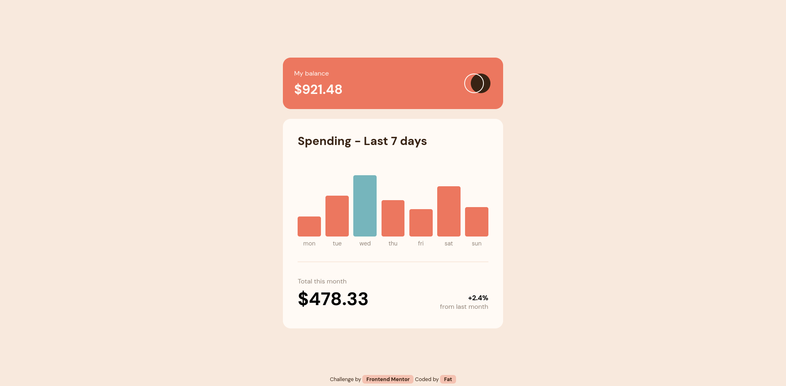

# Frontend Mentor - Expenses chart component solution



This is a solution to the
[Expenses chart component challenge on Frontend Mentor](https://www.frontendmentor.io/challenges/expenses-chart-component-e7yJBUdjwt).
Frontend Mentor challenges help you improve your coding skills by building
realistic projects.

## Table of contents

- [Overview](#overview)
  - [The challenge](#the-challenge)
  - [Links](#links)
- [My process](#my-process)
  - [Built with](#built-with)
  - [What I learned](#what-i-learned)
- [Author](#author)

## Overview

### The challenge

Users should be able to:

- View the bar chart and hover over the individual bars to see the correct
  amounts for each day
- See the current day’s bar highlighted in a different colour to the other bars
- View the optimal layout for the content depending on their device’s screen
  size
- See hover states for all interactive elements on the page
- **Bonus**: Use the JSON data file provided to dynamically size the bars on the
  chart

### Links

- Solution URL: []()
- Live Site URL: []()

## My process

### Built with

- Semantic HTML5 markup
- CSS custom properties
- Flexbox
- Mobile-first workflow

### What I learned

I learned how to set a property in order to make an active state of each bar
that displays the amount spend per day as well as dynamically setting the height
of each bar with the used of json file provided.

```js
// setting the height of each bar
bar.style.setProperty(
  '--height',
  `${Math.floor((data[i].amount / maxSpending) * maxBarHeight)}px`
)
// set attribute for later use of hover effect
bar.setAttribute('data-amount-spend', `$${data[i].amount}`)
```

## Author

- Frontend Mentor - [@Fahatmah](https://www.frontendmentor.io/profile/Fahatmah)
