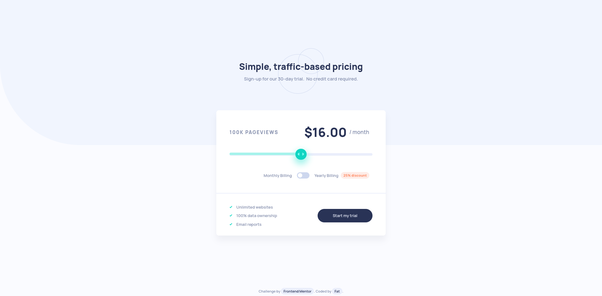

# Frontend Mentor - Interactive pricing component solution



This is a solution to the
[Interactive pricing component challenge on Frontend Mentor](https://www.frontendmentor.io/challenges/interactive-pricing-component-t0m8PIyY8).
Frontend Mentor challenges help you improve your coding skills by building
realistic projects.

## Table of contents

- [Overview](#overview)
  - [The challenge](#the-challenge)
  - [Links](#links)
- [My process](#my-process)
  - [Built with](#built-with)
  - [What I learned](#what-i-learned)
  - [Continued development](#continued-development)
  - [Useful resources](#useful-resources)
- [Author](#author)

## Overview

### The challenge

Users should be able to:

- View the optimal layout for the app depending on their device's screen size
- See hover states for all interactive elements on the page
- Use the slider and toggle to see prices for different page view numbers

### Links

- Solution URL:
  [Repo](https://github.com/Fahatmah/front-end-mentor-challenges/tree/main/interactive-pricing-component)
- Live Site URL:
  [Interactive Pricing Component](https://fahatmah.github.io/front-end-mentor-challenges/interactive-pricing-component/)

## My process

### Built with

- Semantic HTML5 markup
- CSS custom properties
- Flexbox
- CSS Grid
- Mobile-first workflow

### What I learned

- Use of input range type element and how to style it
- Dynamic width of the progress bar
- Used an array to store the price per month

```html
<div class="slider">
  <input
    type="range"
    name="pricingSlider"
    id="pricingSlider"
    step="1"
    min="0"
    max="4"
    value="2"
    oninput="updatePageViewsAndPrice()"
  />
  <div class="progress"></div>
</div>
```

```css
.slider input::-webkit-slider-thumb {
  -webkit-appearance: none;
  appearance: none;
  position: relative;
  z-index: 10;
  pointer-events: auto;
  /* ....rest of the styles */
}

.slider .progress {
  position: absolute;
  top: 60%;
  left: 0;
  transform: translateY(-60%);
  z-index: 1;
  pointer-events: none;
  /* ....rest of the styles */
}
```

```js
const values = [8, 12, 16, 24, 36] // declared a variable of price

const maxValue = priceRangeSlider.getAttribute('max') // range input element max attr
const value = (priceRangeSlider.value / maxValue) * 100 + '%'
progressBar.style.width = value
// ...rest of the code
```

### Continued development
I really want to learn more and sharpen my CSS skills to be able to style elements such as the input range html element

### Useful resources

- [Styling Range Input Element](https://youtu.be/0oePYYXBmm0?si=YfXbdIpjOE9p26tA) - This is where I learned to set a dynamic width of the progress bar

## Author

- Frontend Mentor -
  [@Fahatmah](https://www.frontendmentor.io/profile/Fahatmah)
